

  <!-- Top Glass Navigation Bar -->
  

 

  <!-- Hero Section Interactive Banner -->
  <a href="https://kartik-khaki.vercel.app/">
    
  </a>

 

<!-- Hero Portrait & Quick Details Dual Column -->
<table width="100%" border="0" cellspacing="0" cellpadding="0" style="width:100%; border-collapse:collapse; border:none; background:transparent;">
  <tr>
    <!-- Left Column: Biography & CTA -->
    <td width="65%" valign="top" style="border:none; padding:15px; background:transparent;">
      

        <h1 align="left" style="color:#FFFFFF; font-family:-apple-system, BlinkMacSystemFont, 'Segoe UI', Roboto, sans-serif; font-size:32px; font-weight:800; margin:0 0 10px 0; border:none;">
          Hello, I'm Kartik Soni 👋
        </h1>
        <h3 align="left" style="color:#38BDF8; font-family:-apple-system, BlinkMacSystemFont, 'Segoe UI', Roboto, sans-serif; font-size:18px; font-weight:700; margin:0 0 15px 0;">
          Full Stack Developer • AI Engineer • UI/UX Enthusiast
        </h3>
        

          I craft high-performance full-stack web applications, intelligent AI-powered SaaS solutions, and immersive digital experiences. Based in <b>India</b>, I bridge the gap between complex backend architectures and Apple-inspired, pixel-perfect user interfaces.
        

        <!-- Interactive CTA Button Strip -->
        

          
          &nbsp;
          
          &nbsp;
          
        

      

    </td>
    <!-- Right Column: Profile Frame Showcase -->
    <td width="35%" align="center" valign="middle" style="border:none; padding:15px; background:transparent;">
      
    </td>
  </tr>
</table>

 

<!-- 01. ABOUT ME SECTION -->

  

 

<table width="100%" border="0" cellspacing="0" cellpadding="0" style="width:100%; border-collapse:collapse; background:rgba(255,255,255,0.02); border:1px solid rgba(255,255,255,0.08); border-radius:16px;">
  <tr>
    <td style="padding:25px; color:#94A3B8; font-family:-apple-system, BlinkMacSystemFont, 'Segoe UI', Roboto, sans-serif; font-size:15px; line-height:1.8;">
      <h3 style="color:#FFFFFF; font-size:20px; font-weight:700; margin-top:0;">Precision Engineering Meets Aesthetic Perfection</h3>
      

        As a passionate Full Stack Developer and AI Engineer, I specialize in building end-to-end applications that don't just function flawlessly—they captivate users. My core stack centers around <b>React, Next.js, Node.js, TypeScript, PostgreSQL, and LLM Infrastructure</b>.
      

      <table width="100%" style="border-collapse:collapse; margin-top:15px;">
        <tr>
          <td width="50%" style="padding:10px; background:rgba(56, 189, 248, 0.04); border:1px solid rgba(56, 189, 248, 0.2); border-radius:12px;">
            <strong style="color:#38BDF8;">🎯 Full Stack Mastery</strong> 
            Architecting robust microservices, scalable database schemas, and smooth frontend state logic.
          </td>
          <td width="10"></td>
          <td width="50%" style="padding:10px; background:rgba(168, 85, 247, 0.04); border:1px solid rgba(168, 85, 247, 0.2); border-radius:12px;">
            <strong style="color:#A855F7;">🤖 Artificial Intelligence</strong> 
            Integrating OpenAI & Claude models, building autonomous RAG pipelines and workflow automation.
          </td>
        </tr>
      </table>
    </td>
  </tr>
</table>

 

<!-- 02. FEATURED PROJECTS SECTION -->

  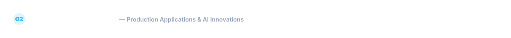

 

<!-- Project 1: Personal Portfolio -->
<table width="100%" border="0" cellspacing="0" cellpadding="0" style="width:100%; border-collapse:collapse; background:rgba(255,255,255,0.03); border:1px solid rgba(56, 189, 248, 0.3); border-radius:20px; overflow:hidden;">
  <tr>
    <td width="45%" valign="middle" style="padding:15px; border:none;">
      <a href="https://kartik-khaki.vercel.app/">
        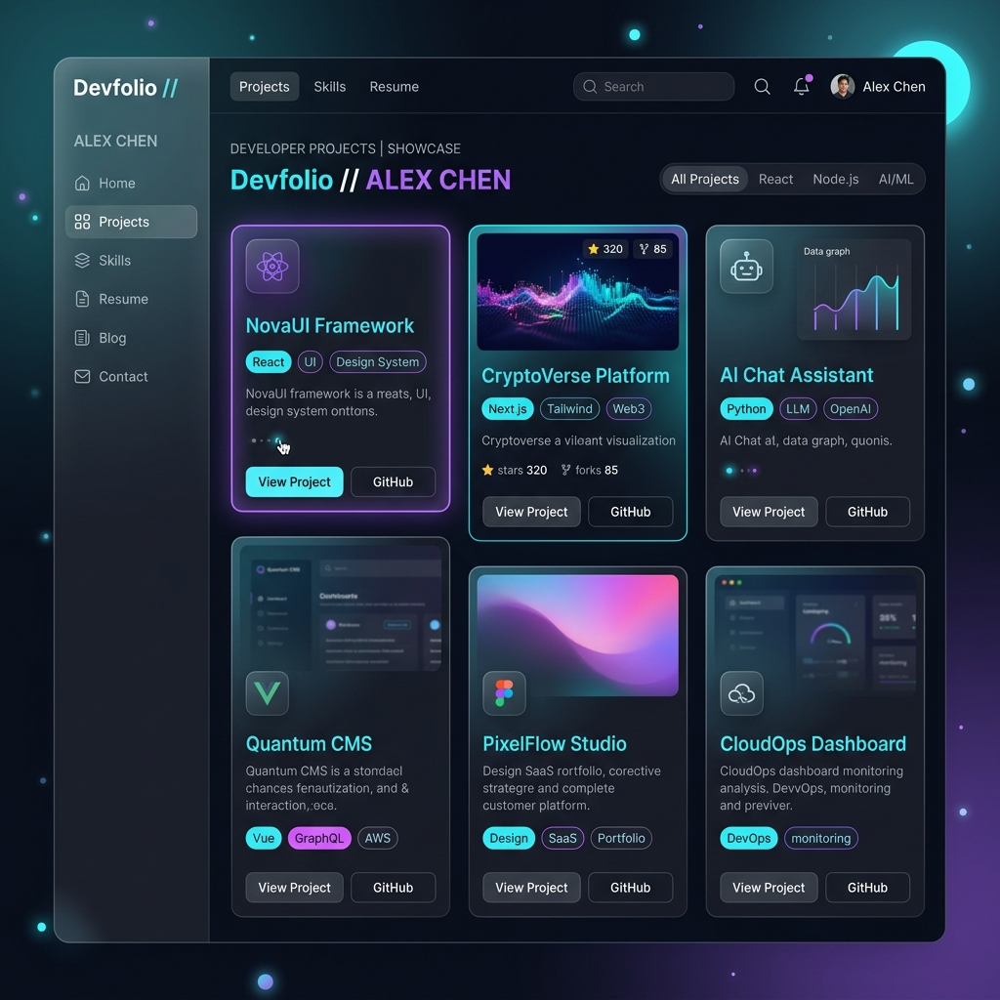
      </a>
    </td>
    <td width="55%" valign="top" style="padding:20px; border:none; font-family:-apple-system, BlinkMacSystemFont, 'Segoe UI', Roboto, sans-serif;">
      FEATURED SHOWCASE
      <h3 style="color:#FFFFFF; font-size:22px; font-weight:800; margin:6px 0 10px 0;">Kartik Soni — Personal Portfolio &amp; Brand Platform</h3>
      

        An award-winning personal web experience engineered with interactive 3D WebGL scenes, ultra-fluid glassmorphism layouts, custom dark mode shaders, and lightning-fast load times.
      

      

        Next.js
        React
        Three.js
        Tailwind CSS
        TypeScript
      

      

        
        &nbsp;
        
      

    </td>
  </tr>
</table>

 

<!-- Project 2: Real-time Auction Platform -->
<table width="100%" border="0" cellspacing="0" cellpadding="0" style="width:100%; border-collapse:collapse; background:rgba(255,255,255,0.03); border:1px solid rgba(168, 85, 247, 0.3); border-radius:20px; overflow:hidden;">
  <tr>
    <td width="45%" valign="middle" style="padding:15px; border:none;">
      <a href="https://github.com/kartiksoni543">
        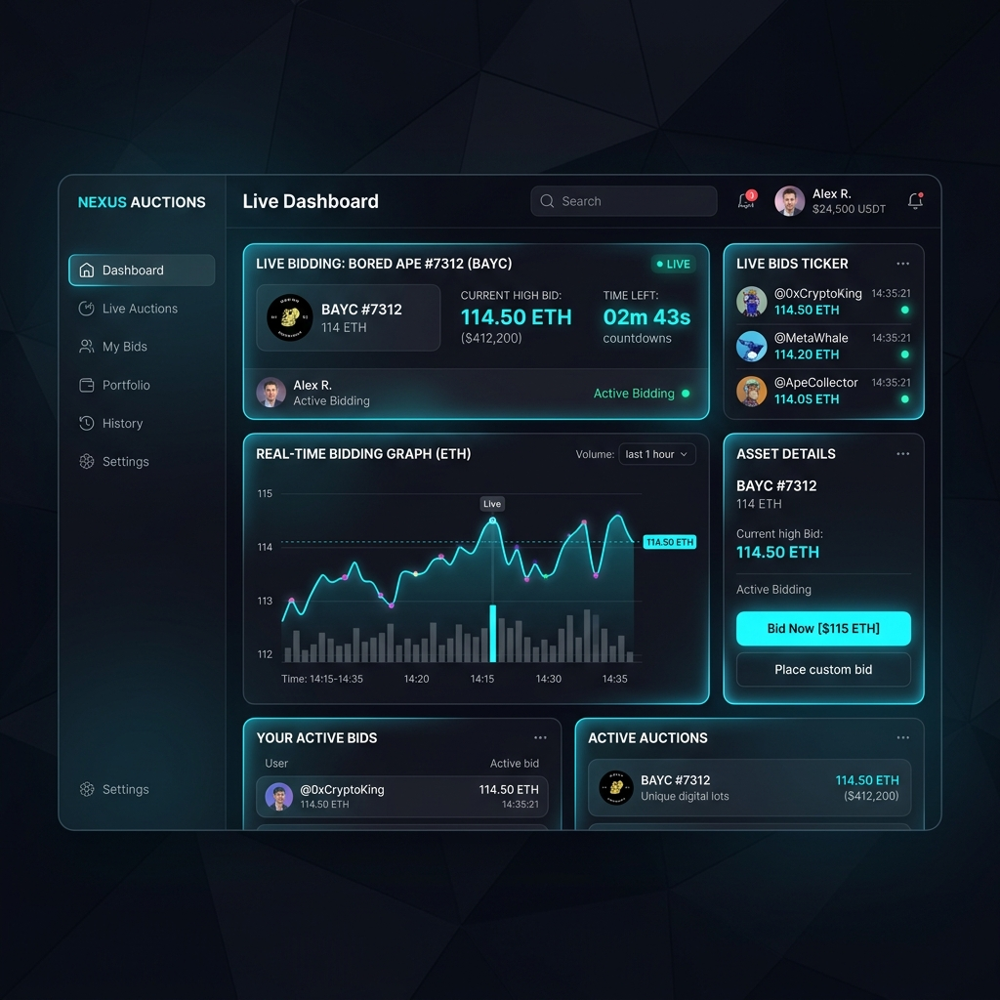
      </a>
    </td>
    <td width="55%" valign="top" style="padding:20px; border:none; font-family:-apple-system, BlinkMacSystemFont, 'Segoe UI', Roboto, sans-serif;">
      HIGH-CONCURRENCY ENGINE
      <h3 style="color:#FFFFFF; font-size:22px; font-weight:800; margin:6px 0 10px 0;">Real-Time Digital Auction &amp; Bidding Platform</h3>
      

        High-throughput real-time bidding system built with WebSocket events, Redis Pub/Sub for sub-millisecond price synchronization, PostgreSQL transaction locks, and live financial charts.
      

      

        React
        Node.js
        Redis
        PostgreSQL
        Prisma
      

      

        
        &nbsp;
        
      

    </td>
  </tr>
</table>

 

<!-- Project 3: OM Speech & Hearing Clinic -->
<table width="100%" border="0" cellspacing="0" cellpadding="0" style="width:100%; border-collapse:collapse; background:rgba(255,255,255,0.03); border:1px solid rgba(34, 197, 94, 0.3); border-radius:20px; overflow:hidden;">
  <tr>
    <td width="45%" valign="middle" style="padding:15px; border:none;">
      <a href="https://github.com/kartiksoni543">
        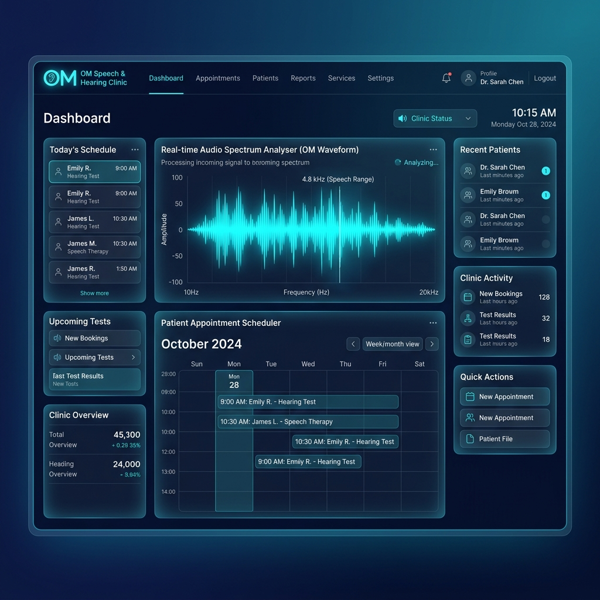
      </a>
    </td>
    <td width="55%" valign="top" style="padding:20px; border:none; font-family:-apple-system, BlinkMacSystemFont, 'Segoe UI', Roboto, sans-serif;">
      HEALTHCARE SAAS
      <h3 style="color:#FFFFFF; font-size:22px; font-weight:800; margin:6px 0 10px 0;">OM Speech &amp; Hearing Clinic Platform</h3>
      

        Comprehensive healthcare platform for patient consultation scheduling, audiogram report management, automated SMS/email reminders, and clinical diagnostic tracking.
      

      

        Next.js
        MongoDB
        TypeScript
        Tailwind CSS
      

      

        
        &nbsp;
        
      

    </td>
  </tr>
</table>

 

<!-- 03. TECH STACK SECTION -->

  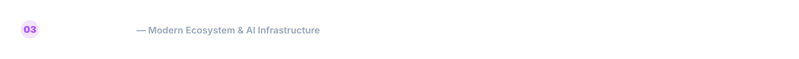

 

<!-- Tech Grid Showcase -->
<table width="100%" border="0" cellspacing="0" cellpadding="0" style="width:100%; border-collapse:collapse; background:rgba(255,255,255,0.02); border:1px solid rgba(255,255,255,0.08); border-radius:20px; padding:20px;">
  <tr>
    <td align="center" style="padding:20px;">
      <!-- Tech Icons Grid -->
      <table border="0" cellspacing="12" cellpadding="0" align="center">
        <!-- Row 1: Frontend & Fullstack -->
        <tr>
          <td align="center" width="85">
            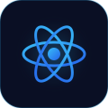 
            React
          </td>
          <td align="center" width="85">
            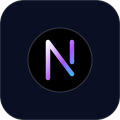 
            Next.js
          </td>
          <td align="center" width="85">
            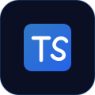 
            TypeScript
          </td>
          <td align="center" width="85">
             
            Tailwind
          </td>
          <td align="center" width="85">
            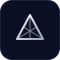 
            Three.js
          </td>
        </tr>
        <!-- Row 2: Backend & Databases -->
        <tr>
          <td align="center" width="85">
            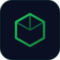 
            Node.js
          </td>
          <td align="center" width="85">
             
            Express
          </td>
          <td align="center" width="85">
             
            MongoDB
          </td>
          <td align="center" width="85">
             
            PostgreSQL
          </td>
          <td align="center" width="85">
             
            Prisma
          </td>
        </tr>
        <!-- Row 3: Infrastructure, Cache & AI -->
        <tr>
          <td align="center" width="85">
             
            Redis
          </td>
          <td align="center" width="85">
             
            Docker
          </td>
          <td align="center" width="85">
             
            AWS
          </td>
          <td align="center" width="85">
             
            OpenAI
          </td>
          <td align="center" width="85">
             
            Claude
          </td>
        </tr>
      </table>
    </td>
  </tr>
</table>

 

<!-- 04. EXPERIENCE & TIMELINE SECTION -->

  

 

<!-- Experience Timeline Table -->
<table width="100%" border="0" cellspacing="0" cellpadding="0" style="width:100%; border-collapse:collapse; font-family:-apple-system, BlinkMacSystemFont, 'Segoe UI', Roboto, sans-serif;">
  <!-- Item 1: Freelance Full Stack Developer -->
  <tr>
    <td width="30" align="center" valign="top" style="padding-top:4px;">
      

    </td>
    <td style="padding:0 0 25px 15px; border-left:2px solid rgba(56, 189, 248, 0.3);">
      <h4 style="color:#FFFFFF; font-size:17px; font-weight:800; margin:0 0 4px 0;">Freelance Full Stack Developer</h4>
      Global Clients &amp; Startups • Present
      

        Building end-to-end custom web applications, SaaS dashboards, and automated APIs tailored to high business metrics.
      

    </td>
  </tr>
  <!-- Item 2: AI Product Development -->
  <tr>
    <td width="30" align="center" valign="top" style="padding-top:4px;">
      

    </td>
    <td style="padding:0 0 25px 15px; border-left:2px solid rgba(168, 85, 247, 0.3);">
      <h4 style="color:#FFFFFF; font-size:17px; font-weight:800; margin:0 0 4px 0;">AI Product Development</h4>
      Autonomous Systems &amp; LLM Engineering
      

        Developing AI integrations, prompt engineering frameworks, OpenAI/Claude API agents, and smart automated data pipelines.
      

    </td>
  </tr>
  <!-- Item 3: Modern UI Development -->
  <tr>
    <td width="30" align="center" valign="top" style="padding-top:4px;">
      

    </td>
    <td style="padding:0 0 25px 15px; border-left:2px solid rgba(37, 99, 235, 0.3);">
      <h4 style="color:#FFFFFF; font-size:17px; font-weight:800; margin:0 0 4px 0;">Modern UI &amp; Design Systems</h4>
      Design Systems &amp; WebGL Craftsmanship
      

        Architecting Apple-inspired glassmorphism interfaces, smooth micro-interactions, responsive design systems, and 3D web graphics.
      

    </td>
  </tr>
  <!-- Item 4: Backend Engineering -->
  <tr>
    <td width="30" align="center" valign="top" style="padding-top:4px;">
      

    </td>
    <td style="padding:0 0 10px 15px;">
      <h4 style="color:#FFFFFF; font-size:17px; font-weight:800; margin:0 0 4px 0;">Backend Engineering &amp; Architecture</h4>
      Scalable Cloud Infrastructure &amp; Databases
      

        Designing resilient REST &amp; GraphQL endpoints, Redis caching strategies, PostgreSQL relational schemas, and Docker container workflows.
      

    </td>
  </tr>
</table>

 

<!-- 05. CURRENT FOCUS SECTION -->

  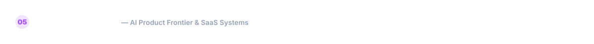

 

<!-- Current Focus 4 Grid -->
<table width="100%" border="0" cellspacing="8" cellpadding="0" style="width:100%; border-collapse:separate; font-family:-apple-system, BlinkMacSystemFont, 'Segoe UI', Roboto, sans-serif;">
  <tr>
    <td width="50%" style="background:rgba(255,255,255,0.03); border:1px solid rgba(56, 189, 248, 0.2); border-radius:16px; padding:18px;">
      <h4 style="color:#38BDF8; font-size:16px; font-weight:800; margin:0 0 8px 0;">🤖 Building AI-Powered Products</h4>
      

        Combining Large Language Models (LLMs), agentic workflows, and semantic search into intuitive consumer &amp; enterprise software.
      

    </td>
    <td width="50%" style="background:rgba(255,255,255,0.03); border:1px solid rgba(168, 85, 247, 0.2); border-radius:16px; padding:18px;">
      <h4 style="color:#C084FC; font-size:16px; font-weight:800; margin:0 0 8px 0;">🚀 Modern SaaS Applications</h4>
      

        Creating turn-key SaaS platforms featuring multi-tenancy, automated billing, role-based access control, and analytics.
      

    </td>
  </tr>
  <tr>
    <td width="50%" style="background:rgba(255,255,255,0.03); border:1px solid rgba(37, 99, 235, 0.2); border-radius:16px; padding:18px;">
      <h4 style="color:#60A5FA; font-size:16px; font-weight:800; margin:0 0 8px 0;">⚡ High-Performance Frontend</h4>
      

        Pushing the boundaries of web performance, WebGL 3D graphics, sub-second renders, and 100/100 Lighthouse metrics.
      

    </td>
    <td width="50%" style="background:rgba(255,255,255,0.03); border:1px solid rgba(34, 197, 94, 0.2); border-radius:16px; padding:18px;">
      <h4 style="color:#4ADE80; font-size:16px; font-weight:800; margin:0 0 8px 0;">🔄 Smart Automation &amp; CI/CD</h4>
      

        Automating development loops, containerized deployments, GitHub Actions pipelines, and cloud server provisioning.
      

    </td>
  </tr>
</table>

 

<!-- FOOTER SECTION -->

  <a href="https://kartik-khaki.vercel.app/">
    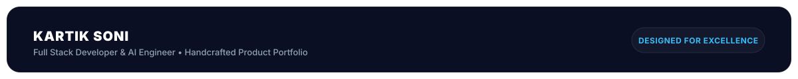
  </a>

 

<!-- Quick Links Footer Strip -->

  <a href="https://kartik-khaki.vercel.app/" style="color:#38BDF8; text-decoration:none; font-weight:700;">Portfolio</a>
  &nbsp;•&nbsp;
  <a href="https://www.linkedin.com/in/kartik-soni-596b31291/" style="color:#38BDF8; text-decoration:none; font-weight:700;">LinkedIn</a>
  &nbsp;•&nbsp;
  <a href="mailto:kartiksoni543@gmail.com" style="color:#A855F7; text-decoration:none; font-weight:700;">Email Contact</a>
  &nbsp;•&nbsp;
  <a href="https://github.com/kartiksoni543" style="color:#38BDF8; text-decoration:none; font-weight:700;">GitHub</a>
    
  © 2026 Kartik Soni. Handcrafted with passion, glassmorphism aesthetics, and clean code.

